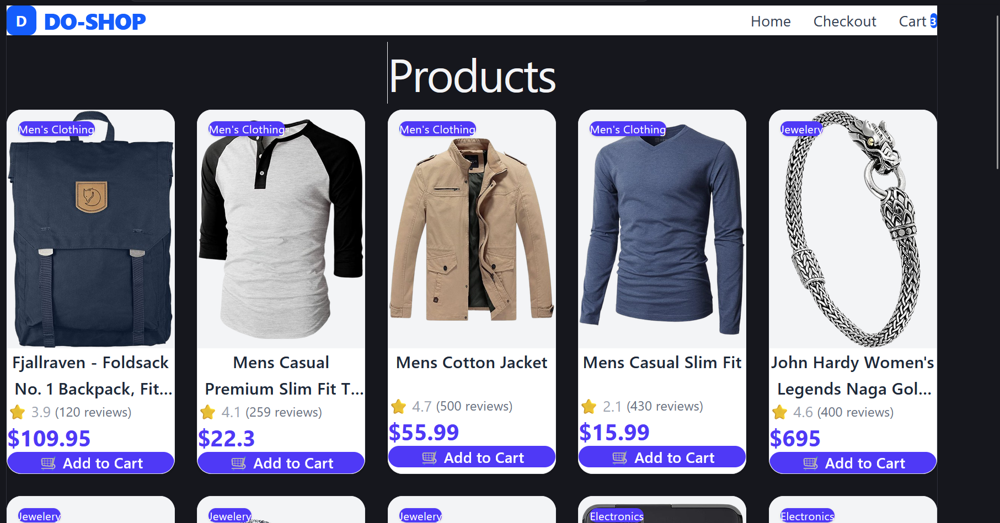
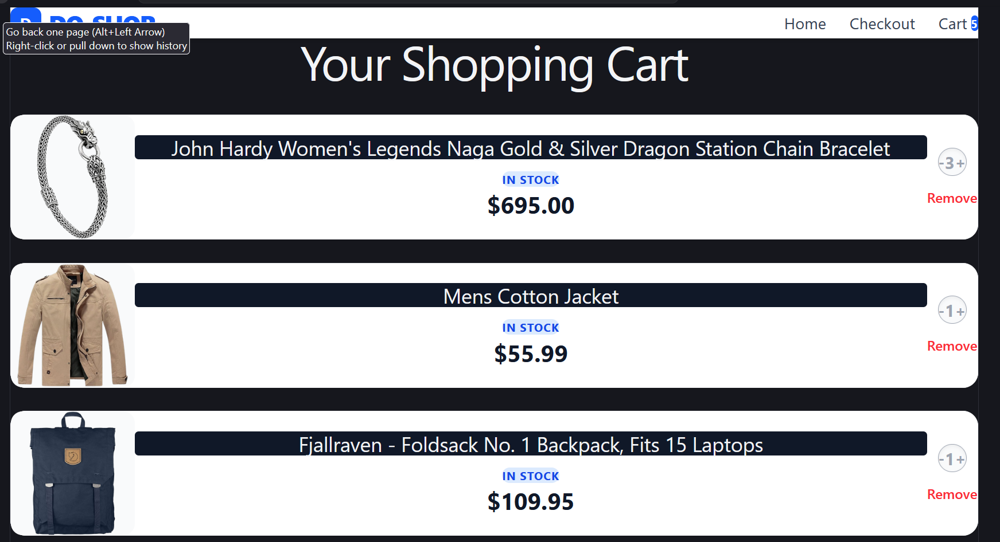
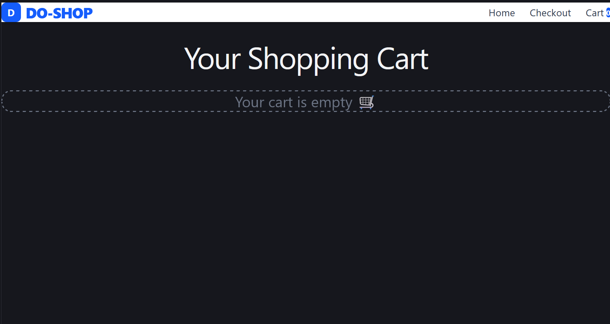

# 🛒 React Shopping Cart

A modern and responsive Shopping Cart application built with **React**, **React Query**, **Zustand**, and **Tailwind CSS**.

## 🚀 Live Demo

https://do-shop-eight.vercel.app/

---

## 📸 Screenshots

### 🏠 Home Page



### 🛒 Shopping Cart



### 📦 Empty Cart



---

## ✨ Features

- 🛍️ Fetch products from Fake Store API
- ⚡ Fast API fetching using React Query
- 🌍 Global state management with Zustand
- ➕ Add products to cart
- 🔼 Increase quantity
- 🔽 Decrease quantity
- ❌ Remove products
- 💰 Automatic total price calculation
- 📱 Responsive UI
- 🎨 Modern card design with Tailwind CSS

---

## 🛠️ Tech Stack

- React
- React Router
- React Query
- Zustand
- Tailwind CSS
- Fake Store API

---

## 📂 Project Structure

```text
src
│
├── components
│   ├── Navbar.jsx
│   ├── ProductCard.jsx
│   └── ProductGrid.jsx
│
├── pages
│   ├── Home.jsx
│   └── Cart.jsx
│
├── stores
│   └── CartStore.js
│
├── services
│   └── api.js
│
└── App.jsx
```

---

## 📖 What I Learned

During this project, I learned how to:

- Manage global state using Zustand
- Fetch and cache API data with React Query
- Build reusable React components
- Handle immutable state updates using map() and filter()
- Calculate totals using reduce()
- Design responsive UI using Tailwind CSS

---

## 🚀 Future Improvements

- ✅ Persistent cart using Zustand Persist
- ✅ Product search
- ✅ Product filtering
- ✅ Infinite scrolling
- ✅ Wishlist feature
- ✅ Backend integration with Node.js & MongoDB
- ✅ User Authentication
- ✅ Real Checkout & Payment Gateway

---

## 📦 Installation

```bash
git clone https://github.com/yourusername/react-shopping-cart.git

cd react-shopping-cart

npm install

npm run dev
```

---

## 👨‍💻 Author

**Anant Kumar**

GitHub:
https://github.com/Anant23452

---

⭐ If you liked this project, consider giving it a star!